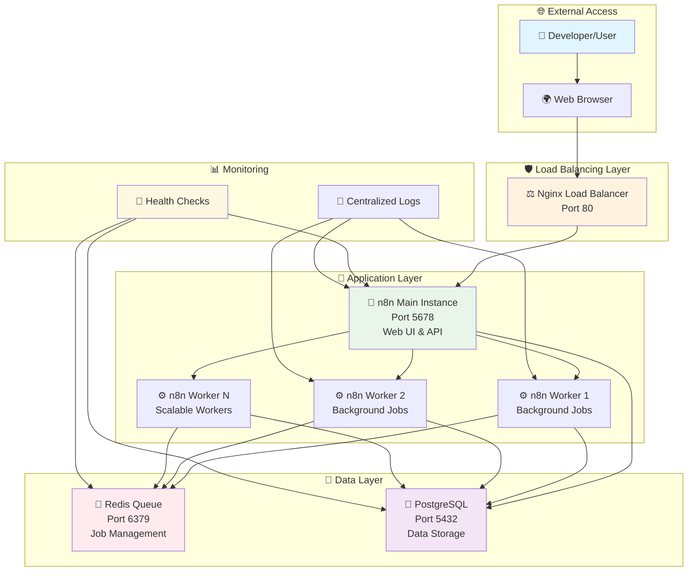

# ⚡ n8n Enterprise AI Setup - The Ultimate Automation Fortress

<div align="center">


**🦸‍♂️ Engineered by [Shivam Chopra](https://github.com/Shivam-2WaysTech) - The Automation Architect**

*"With great automation comes great responsibility"* - Uncle Ben (probably)

</div>

---

## 🌟 The Origin Story

Welcome to the **most powerful n8n setup in the multiverse**! This isn't just another Docker Compose file - it's a **re-engineered enterprise-grade automation fortress** that transforms the standard n8n experience into a scalable, self-contained powerhouse.

### 🚀 What Makes This Setup Legendary?

Born from the need to democratize enterprise automation, this setup breaks free from cloud dependencies and gives you:

- **🏰 Fortress of Solitude**: Completely self-contained local environment
- **⚡ Lightning Speed**: Queue-based execution with Redis for blazing performance
- **🔄 Infinite Scaling**: Horizontal worker scaling that grows with your ambitions
- **🛡️ Impenetrable Security**: Network isolation and environment-based secrets
- **🎯 AI-Ready Arsenal**: Perfect foundation for building and scaling AI agents
- **📊 Command Center**: Built-in monitoring and health checks

### 💪 Superpowers Unlocked

✅ **Zero Cloud Dependencies** - Your data stays in your fortress
✅ **Enterprise-Grade Scaling** - Handle thousands of concurrent workflows
✅ **AI Agent Development** - Perfect platform for intelligent automation
✅ **Load Balancing** - Nginx-powered traffic distribution
✅ **Queue Management** - Redis-backed job processing
✅ **Health Monitoring** - Real-time system diagnostics
✅ **Email Integration** - SMTP support for all major providers
✅ **Data Persistence** - Your workflows survive any restart

### 🎯 Mission Objectives

This setup is your secret weapon for:
- **🤖 AI Agent Development** - Build intelligent automation workflows
- **🏢 Enterprise Automation** - Scale workflows across your organization
- **🔬 Workflow Experimentation** - Safe local environment for testing
- **📈 Performance Testing** - Stress-test your automations locally
- **🎓 Learning & Training** - Master n8n without cloud costs

---

## 📋 Table of Contents

- [🌟 The Origin Story](#-the-origin-story)
- [🏗️ The Master Plan (Architecture)](#️-the-master-plan-architecture)
- [🛠️ Fortress Setup (Installation)](#️-fortress-setup-installation)
- [⚡ Superpower Demonstrations (Usage)](#-superpower-demonstrations-usage)
- [🏛️ Command Center Blueprint (Structure)](#️-command-center-blueprint-structure)
- [🎯 The Arsenal (Advanced Features)](#-the-arsenal-advanced-features)
- [🎓 Training Academy (Development)](#-training-academy-development)
- [🆘 Emergency Protocols (Troubleshooting)](#-emergency-protocols-troubleshooting)
- [📞 Hall of Records (Support)](#-hall-of-records-support)

---

## 🏗️ The Master Plan (Architecture)

Behold the **Automation Fortress** - a carefully orchestrated symphony of services working in perfect harmony:



### 🎭 The Cast of Characters

| Service | Role | Port | Superpower |
|---------|------|------|------------|
| **🚀 n8n Main** | The Commander | 5678 | Web interface, API, workflow orchestration |
| **⚙️ n8n Workers** | The Workforce | - | Background job processing, infinite scaling |
| **🐘 PostgreSQL** | The Memory Bank | 5432 | Persistent data storage, ACID compliance |
| **🔴 Redis** | The Speed Demon | 6379 | Lightning-fast queue management |
| **⚖️ Nginx** | The Guardian | 80 | Load balancing, traffic distribution |

---

## 🛠️ Fortress Setup (Installation)

Ready to build your automation empire? Let's get this fortress operational in **under 5 minutes**! 🚀

### 🔧 Prerequisites (Assemble Your Tools)

Before we begin, ensure your system has these superpowers:

```bash
# Required Arsenal
✅ Docker Engine 20.10+     # The container orchestrator
✅ Docker Compose 2.0+      # The service conductor
✅ 4GB+ RAM (8GB+ recommended) # The memory fortress
✅ 20GB+ disk space         # The storage vault
✅ Multi-core CPU (4+ cores) # The processing power
```

### 🚀 Quick Deploy (The One-Command Wonder)

**Option 1: The Automated Hero Route** ⚡
```bash
# Clone the fortress
git clone https://github.com/Shivam-2WaysTech/n8n-enterprise-ai-setup-free.git
cd n8n-enterprise-ai-setup-free

# Deploy with superpowers activated
./scripts/setup.sh

# Launch the fortress
docker-compose up -d

# Verify your powers
./scripts/health-check.sh
```

**Option 2: The Manual Master Route** 🎯
```bash
# 1. Prepare your environment
cp .env.example .env

# 2. Generate your encryption key (CRITICAL!)
openssl rand -base64 32
# Copy this key to N8N_ENCRYPTION_KEY in .env

# 3. Customize your fortress (edit .env file)
nano .env  # Update passwords and settings

# 4. Launch all systems
docker-compose up -d

# 5. Run diagnostics
./scripts/health-check.sh
```

### 📧 Email Powers Activation (SMTP Setup)

Want to send emails from your workflows? Activate email superpowers:

#### 🔥 Gmail Setup (Recommended for Heroes)
```bash
# In your .env file:
N8N_SMTP_HOST=smtp.gmail.com
N8N_SMTP_PORT=587
N8N_SMTP_USER=your-hero-email@gmail.com
N8N_SMTP_PASS=your-app-password  # Generate in Google Account Settings
N8N_SMTP_SENDER=your-hero-email@gmail.com
N8N_SMTP_STARTTLS=true
```

#### ⚡ Other Email Providers
```bash
# Microsoft Outlook/Hotmail
N8N_SMTP_HOST=smtp-mail.outlook.com

# Yahoo Mail
N8N_SMTP_HOST=smtp.mail.yahoo.com

# Custom SMTP Server
N8N_SMTP_HOST=your-custom-server.com
```

### ✅ Victory Verification

After deployment, you should see:
```bash
🎯 Access Points:
- n8n Web Interface: http://localhost:5678
- Load Balancer: http://localhost:80
- Database: localhost:5432
- Redis: localhost:6379

🏥 Health Status: All systems operational ✅
```

---

## ⚡ Superpower Demonstrations (Usage)

Time to flex those automation muscles! Here's how to wield your new powers:

### 🎮 Basic Commands (Your Daily Arsenal)

```bash
# 🚀 Launch the fortress
docker-compose up -d

# 🔍 Check your army status
docker-compose ps

# 🏥 Run full health diagnostics
./scripts/health-check.sh

# 📊 Monitor your forces in real-time
docker-compose logs -f

# 🛑 Graceful shutdown
docker-compose down

# 💥 Nuclear option (destroys all data!)
docker-compose down -v
```

### 🔄 Scaling Your Army (Worker Management)

```bash
# 📈 Scale up workers for heavy lifting
docker-compose up -d --scale n8n-worker=5

# 📉 Scale down for resource conservation
docker-compose up -d --scale n8n-worker=2

# 🎯 Check your worker army
docker-compose ps | grep worker

# 📊 Monitor worker performance
docker stats
```

### 🏥 Health & Monitoring (Command Center)

```bash
# 🔍 Full system health check
./scripts/health-check.sh

# 📊 Individual service health
docker-compose exec postgres pg_isready -U n8n -d n8n
docker-compose exec redis redis-cli -a redis_password ping
curl -s http://localhost:5678/healthz

# 📈 Resource monitoring
docker stats --no-stream

# 📝 Service logs
docker-compose logs n8n          # Main application
docker-compose logs postgres     # Database logs
docker-compose logs redis        # Queue logs
docker-compose logs nginx        # Load balancer logs
```

### 💾 Backup & Restore (Data Protection)

```bash
# 🛡️ Create fortress backup
mkdir -p backups/$(date +%Y%m%d)

# 💾 Backup database
docker-compose exec postgres pg_dump -U n8n n8n > backups/$(date +%Y%m%d)/database.sql

# 📦 Backup n8n workflows and settings
docker cp $(docker-compose ps -q n8n):/home/node/.n8n backups/$(date +%Y%m%d)/n8n-data

# 🔄 Restore database
docker-compose exec -T postgres psql -U n8n -d n8n < backups/20240829/database.sql

# 🔄 Restore n8n data
docker cp backups/20240829/n8n-data $(docker-compose ps -q n8n):/home/node/.n8n
docker-compose restart n8n
```

### 🎯 Development Workflows

```bash
# 🔧 Development mode with live logs
docker-compose up --build

# 🐛 Debug specific service
docker-compose logs -f n8n

# 🔄 Restart single service
docker-compose restart n8n

# 🧪 Test configuration changes
docker-compose config

# 🔍 Inspect service details
docker-compose exec n8n /bin/sh
```

---

## 🏛️ Command Center Blueprint (Project Structure)

Understanding your fortress layout is crucial for mastery. Here's the complete blueprint:

```
n8n-enterprise-ai-setup-free/
├── 🏗️ docker-compose.yaml          # The master orchestration file
├── 🔧 .env                         # Your secret configuration vault
├── 📋 .env.example                 # Configuration template & guide
├── 📚 README.md                    # This epic documentation
├── 📖 SETUP.md                     # Detailed setup instructions
├── 📊 LOCAL_DEVELOPMENT_SUMMARY.md # Project overview & status
├── 📜 LICENSE                      # Legal framework
├── 🛡️ nginx/                       # Load balancer configuration
│   └── load-balancer/
│       └── n8n-load-balancer.conf  # Nginx routing rules
└── 🔧 scripts/                     # Automation utilities
    ├── setup.sh                    # Automated setup wizard
    └── health-check.sh             # System diagnostics tool
```

### 🎯 Key Files Explained

| File | Purpose | Superpower |
|------|---------|------------|
| **🏗️ docker-compose.yaml** | Service orchestration | Defines all services, networks, and volumes |
| **🔧 .env** | Configuration secrets | Contains passwords, keys, and settings |
| **📋 .env.example** | Configuration template | Safe template with documentation |
| **🛡️ nginx/load-balancer/** | Traffic management | Routes requests and balances load |
| **🔧 scripts/setup.sh** | Automated deployment | One-command fortress setup |
| **🏥 scripts/health-check.sh** | System monitoring | Comprehensive health diagnostics |

### 💾 Data Persistence Strategy

Your fortress uses Docker volumes for data that survives restarts:

```yaml
volumes:
  n8n_data:          # 🎯 Workflows, credentials, settings
  postgres_data:     # 🐘 Database tables and indexes
  redis_data:        # 🔴 Queue state and cache
```

### 🌐 Network Architecture

Services communicate through isolated Docker networks:
- **Internal Network**: Secure service-to-service communication
- **External Ports**: Only necessary ports exposed to host
- **Load Balancer**: Single entry point for external traffic

---

## 🎯 The Arsenal (Advanced Features)

Your fortress comes equipped with enterprise-grade superpowers:

### ⚡ Horizontal Scaling Powers

```bash
# 📈 Scale workers based on workload
docker-compose up -d --scale n8n-worker=10

# 🎯 Auto-scaling strategy
# Monitor queue depth: docker-compose exec redis redis-cli -a redis_password llen bull:n8n:waiting
# Scale up when queue > 100: docker-compose up -d --scale n8n-worker=5
# Scale down when queue < 10: docker-compose up -d --scale n8n-worker=2
```

### 🛡️ Security Features

| Feature | Implementation | Benefit |
|---------|---------------|---------|
| **🔐 Network Isolation** | Docker internal networks | Services can't be accessed externally |
| **🔑 Environment Secrets** | .env file configuration | Passwords never in code |
| **🛡️ Rate Limiting** | Nginx configuration | Prevents API abuse |
| **🔒 Encryption** | 32-character encryption key | Secure credential storage |
| **🚫 Basic Auth** | Optional n8n authentication | Additional access control |

### 📊 Performance Optimization

```bash
# 🚀 Worker concurrency tuning
N8N_WORKER_CONCURRENCY=20  # Adjust based on CPU cores

# 💾 Database optimization
POSTGRES_SHARED_BUFFERS=256MB
POSTGRES_EFFECTIVE_CACHE_SIZE=1GB

# 🔴 Redis memory optimization
REDIS_MAXMEMORY=512mb
REDIS_MAXMEMORY_POLICY=allkeys-lru
```

### 📈 Monitoring & Observability

```bash
# 📊 Real-time metrics
docker stats

# 🔍 Queue monitoring
docker-compose exec redis redis-cli -a redis_password info

# 📝 Log aggregation
docker-compose logs --tail=100 -f

# 🏥 Health endpoints
curl http://localhost:5678/healthz     # n8n health
curl http://localhost:80/healthz       # Load balancer health
```

### 🔄 Load Balancing Configuration

The Nginx load balancer provides:
- **🎯 Intelligent Routing**: API vs webhook traffic separation
- **⚡ Rate Limiting**: Configurable per endpoint
- **🛡️ Security Headers**: XSS protection, content type validation
- **📊 Health Checks**: Automatic unhealthy instance removal
- **🔄 Session Persistence**: Sticky sessions when needed

---

## 🎓 Training Academy (Development)

Ready to become an n8n automation master? Here's your training program:

### 🚀 Getting Started Missions

1. **🎯 Mission 1: First Workflow**
   - Access http://localhost:5678
   - Create a simple HTTP webhook workflow
   - Test with curl or Postman

2. **🔄 Mission 2: Database Integration**
   - Connect to your PostgreSQL database
   - Create workflows that read/write data
   - Practice with different node types

3. **📧 Mission 3: Email Automation**
   - Configure SMTP settings
   - Build email notification workflows
   - Test with different triggers

### 🛠️ Development Best Practices

```bash
# 🔧 Development workflow
1. Make changes to workflows in n8n UI
2. Test thoroughly in local environment
3. Export workflows as JSON
4. Version control your workflow files
5. Use environment variables for credentials

# 📊 Performance testing
1. Create test workflows with multiple nodes
2. Scale workers: docker-compose up -d --scale n8n-worker=5
3. Monitor with: ./scripts/health-check.sh
4. Check queue depth: docker-compose exec redis redis-cli -a redis_password llen bull:n8n:waiting
```

### 🤝 Contributing to the Fortress

Want to make this setup even more legendary? Here's how:

1. **🍴 Fork the Repository**
2. **🌿 Create Feature Branch**: `git checkout -b feature/amazing-feature`
3. **💻 Make Your Changes**: Improve documentation, add features, fix bugs
4. **✅ Test Thoroughly**: Ensure all services work correctly
5. **📝 Update Documentation**: Keep README and SETUP.md current
6. **🚀 Submit Pull Request**: Describe your improvements

### 🎯 Development Environment Variables

```bash
# 🔧 Development-specific settings
N8N_LOG_LEVEL=debug              # Verbose logging
N8N_DISABLE_UI=false             # Keep UI enabled
N8N_TEMPLATES_ENABLED=true       # Enable workflow templates
N8N_DIAGNOSTICS_ENABLED=true     # Enable diagnostics
```

---

## 🆘 Emergency Protocols (Troubleshooting)

When things go sideways, here's your emergency response guide:

### 🚨 Critical Issues

#### 🔥 n8n Won't Start
```bash
# 1. Check all systems
./scripts/health-check.sh

# 2. Examine the logs
docker-compose logs n8n

# 3. Verify configuration
docker-compose config

# 4. Nuclear restart
docker-compose restart n8n

# 5. Last resort - full reset
docker-compose down && docker-compose up -d
```

#### 🐘 Database Connection Failed
```bash
# 1. Test database health
docker-compose exec postgres pg_isready -U n8n -d n8n

# 2. Check database logs
docker-compose logs postgres

# 3. Verify credentials in .env
grep POSTGRES .env

# 4. Reset database (⚠️ DESTROYS DATA!)
docker-compose down -v
docker-compose up -d
```

#### 🔴 Redis Queue Issues
```bash
# 1. Test Redis connection
docker-compose exec redis redis-cli -a redis_password ping

# 2. Check queue status
docker-compose exec redis redis-cli -a redis_password info

# 3. Clear stuck jobs (if needed)
docker-compose exec redis redis-cli -a redis_password flushall

# 4. Restart Redis
docker-compose restart redis
```

#### 🌐 Port Conflicts
```bash
# 1. Find what's using your ports
lsof -i :5678  # n8n
lsof -i :5432  # PostgreSQL
lsof -i :6379  # Redis
lsof -i :80    # Nginx

# 2. Kill conflicting processes or change ports in docker-compose.yaml
```

### 🔧 Performance Issues

```bash
# 📊 Monitor resource usage
docker stats

# 🔍 Check disk space
df -h

# 📈 Scale workers if needed
docker-compose up -d --scale n8n-worker=5

# 🧹 Clean up Docker resources
docker system prune -f
```

---

## 📞 Hall of Records (Support & Information)

### 🦸‍♂️ The Architect

**Shivam Chopra** - *The Automation Architect*
- 🌐 **GitHub**: [@Shivam-2WaysTech](https://github.com/Shivam-2WaysTech)
- 📧 **Email**: shivam@2ways.tech
- 🏢 **Company**: 2Ways Tech Solutions
- 💼 **LinkedIn**: Connect for enterprise automation consulting

### 📚 Documentation Library

| Document | Purpose | Audience |
|----------|---------|----------|
| **📖 README.md** | Main documentation & quick start | All users |
| **📋 SETUP.md** | Detailed setup instructions | Developers |
| **📊 LOCAL_DEVELOPMENT_SUMMARY.md** | Project overview & status | Project managers |
| **🔧 .env.example** | Configuration reference | System administrators |

### 🆘 Getting Help

**Before Seeking Help:**
1. 🏥 Run `./scripts/health-check.sh`
2. 📝 Check `docker-compose logs`
3. 📖 Review troubleshooting section above
4. 🔍 Search existing GitHub issues

**Support Channels:**
- 🐛 **Bug Reports**: [GitHub Issues](https://github.com/Shivam-2WaysTech/n8n-enterprise-ai-setup-free/issues)
- 💡 **Feature Requests**: [GitHub Discussions](https://github.com/Shivam-2WaysTech/n8n-enterprise-ai-setup-free/discussions)
- 📧 **Enterprise Support**: shivam@2ways.tech

### 📜 Legal & Licensing

```
MIT License - Free for commercial and personal use

Copyright (c) 2024 Shivam Chopra / 2Ways Tech Solutions

Permission is hereby granted, free of charge, to any person obtaining a copy
of this software and associated documentation files (the "Software"), to deal
in the Software without restriction, including without limitation the rights
to use, copy, modify, merge, publish, distribute, sublicense, and/or sell
copies of the Software, and to permit persons to whom the Software is
furnished to do so, subject to the following conditions:

The above copyright notice and this permission notice shall be included in all
copies or substantial portions of the Software.
```

### 🙏 Acknowledgments

This fortress stands on the shoulders of giants:
- **n8n.io** - The incredible automation platform
- **Docker** - Containerization technology
- **PostgreSQL** - Reliable database engine
- **Redis** - Lightning-fast data structure store
- **Nginx** - High-performance web server
- **The Open Source Community** - For making this possible

### 🌟 Star History

If this project helped you build amazing automations, consider giving it a ⭐!

```bash
# Show your appreciation
git clone https://github.com/Shivam-2WaysTech/n8n-enterprise-ai-setup-free.git
cd n8n-enterprise-ai-setup-free
# Click the ⭐ button on GitHub!
```

---

<div align="center">

### 🚀 Ready to Build the Future of Automation?

**Your fortress awaits. Deploy now and unleash your automation superpowers!**

```bash
git clone https://github.com/Shivam-2WaysTech/n8n-enterprise-ai-setup-free.git
cd n8n-enterprise-ai-setup-free
./scripts/setup.sh
docker-compose up -d
```

**🎯 Access your automation fortress: http://localhost:5678**

---

*"With great automation comes great responsibility"* - Uncle Ben (probably)

**Built with ❤️ by [Shivam Chopra](https://github.com/Shivam-2WaysTech) | Powered by n8n | Made for Heroes**

</div>